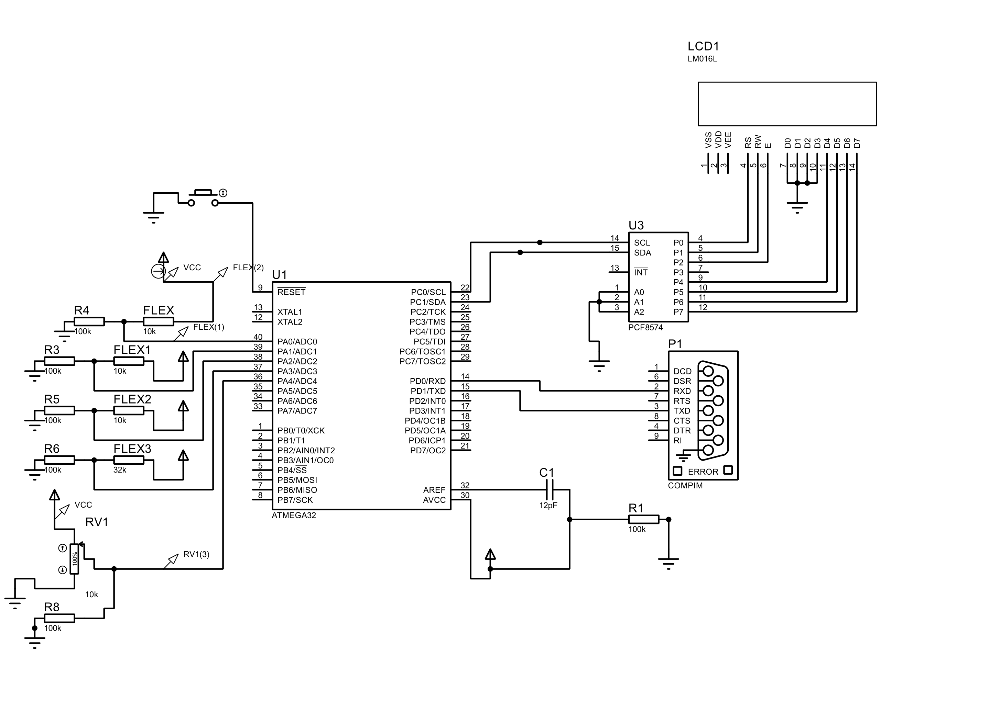

This project aims to convert flex sensor (installed on fingers) signs Into binary values that will be
translated based on customized dictionary to strings that are pronounced by peripheral device. 

don't forget to change slave address in (LDCI2C_CFG.h).. 
in the prouteos simulation PCF8574 adress was 0x020 (a0,a1,a2->ground)  
but for the physical LCD i used (PCF8574T-I2C-1602-16X2-LCD) address was 0x27
 
layers:

activity diagram:

sequence diagram:

this image represents the connections:

FLEX SENSORS Are represented as resistors (they actually are.)
but one of them is a potentiometer so you can simulate 
how changing resistance change the behaviour 

DO NOT FORGET TO Invert RXD AND TXD Pins 
if you are using USB to TTL as in the simulation i'm connecting two ports
using a virtual ports program..
However in real life you'll be using one port (usb to ttl) and the data recieved from 
TXD(usb) should go to pin RXD(micro_controller)
data sent through TXD(micro_controller) should go to pin RXD(usb)

the UART reviever python code:

.png)

I will update more information on a PDF file that explains everything later (after the porject discussion)
so wish me luck

****update****
you can find the PDF file now on:
deaf_gloves/69t8li0rcy1q2374LY.pdf 
