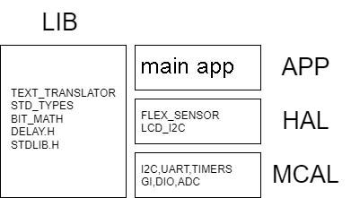
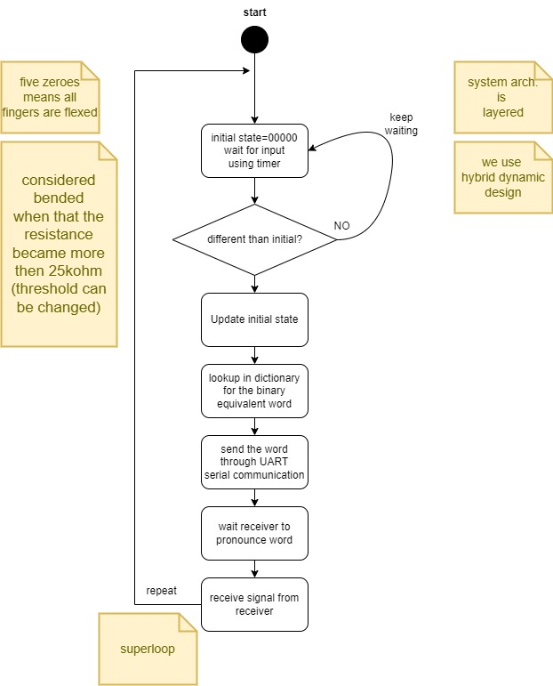
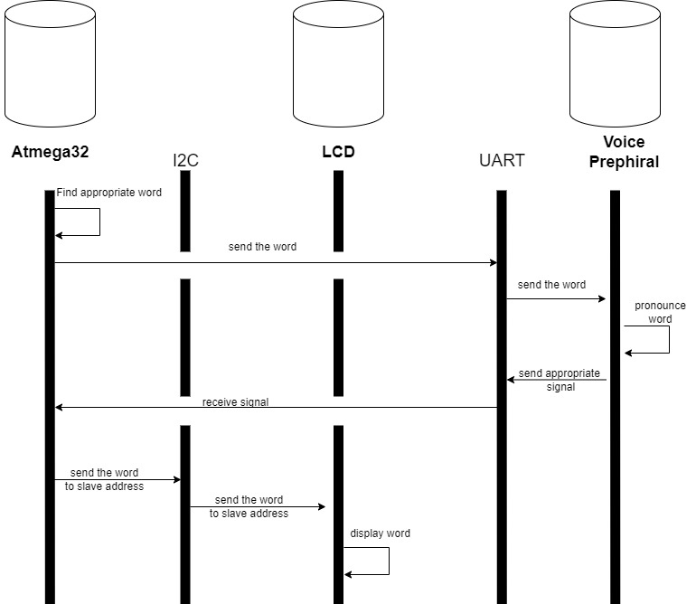
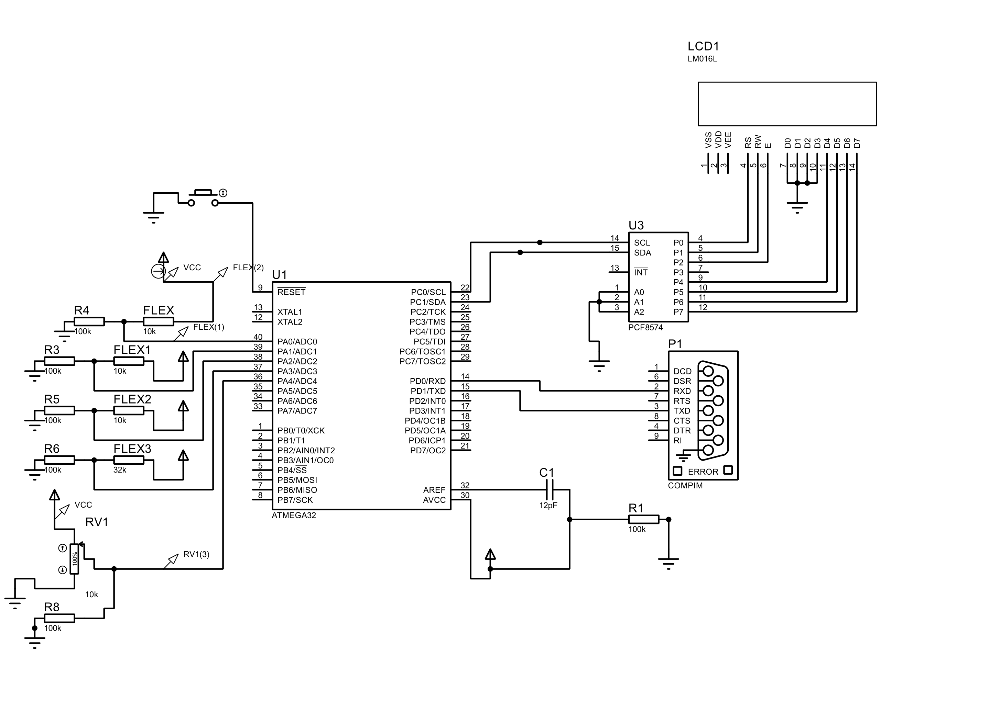

This project aims to convert flex sensor installed on fingers signs Into binary values that will be
translated based on customized dictionary to strings that are pronounced by peripheral device. 

layers:

activity diagram:

sequence diagram:

this image represents the connections:

note flex sensors are just resistors in the previous connections images 
i made last resistance as a potientometer in to be able to change it
during the runtime of the simulation but in real world it's just resistor

the UART reviever python code:

.png")
